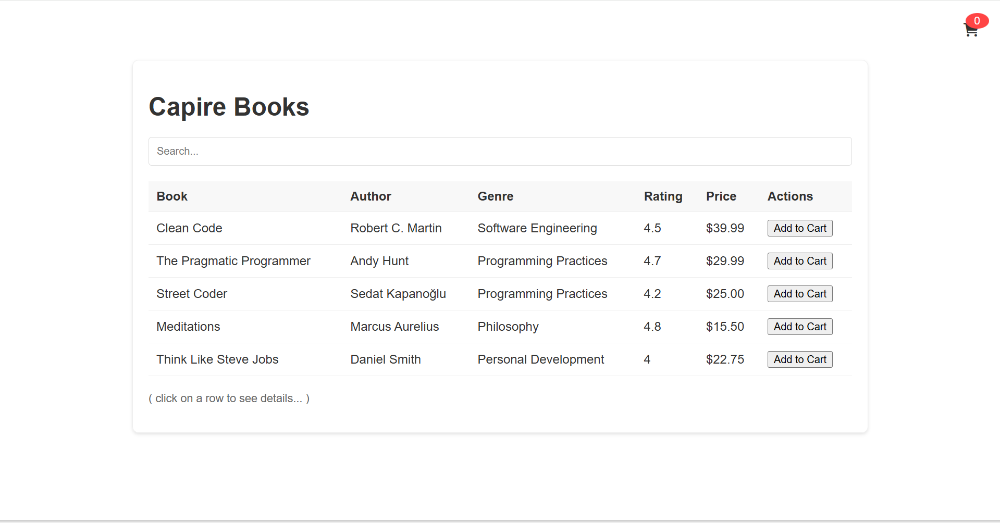
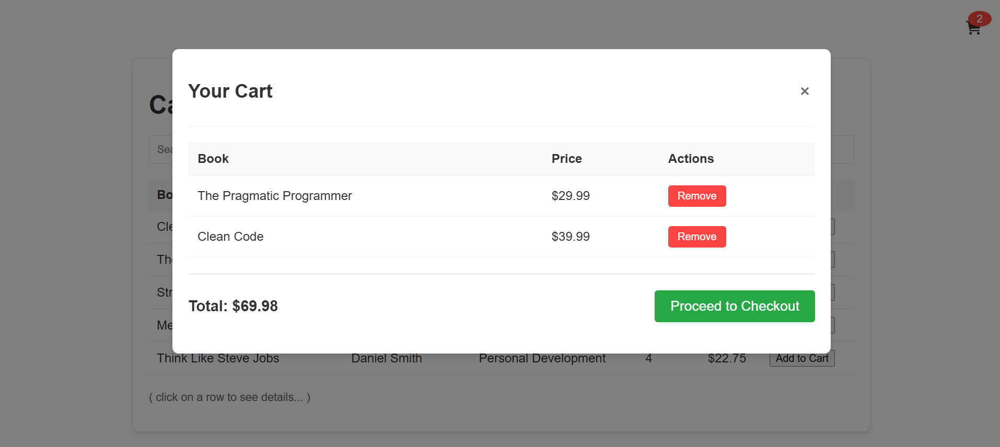

# Bookshop Project

## Overview

This project is a simple web-based bookshop application built using SAP CAP (Cloud Application Programming model) and a Node.js backend. It allows users to browse a catalog of books (with details such as title, author, genre, rating, and price), search for books, add books to a cart, and (in the future) proceed to checkout.

## Features

- **Book Catalog:** Displays a table of books with columns for Book (title), Author, Genre, Rating, Price, and an "Add to Cart" action.
- **Search:** Users can search for books by title, author, or genre.
- **Cart:** A modal view (triggered by the cart button) shows the cart items (book title, price, and a "Remove" button) and a total. (Checkout functionality is planned for future updates.)
- **Book Details:** Clicking on a book row (or "Add to Cart" button) displays an alert with book details (including title, author, genre, rating, and price).

## Project Structure

- **app/:** Contains the frontend (HTML, CSS, and JavaScript) files.
  - **index.html:** The main HTML page (with a table for books and a cart modal).
  - **styles.css:** Styling for the bookshop UI.
  - **scripts.js:** JavaScript (using fetch) to load book data (from the CAP service) and render the book catalog, cart, and search functionality.
- **srv/:** Contains the CAP service definitions (e.g. `cat-service.cds` and `cat-service.js`) that expose the book catalog (and cart) endpoints.
- **db/:** Contains the data model (in `schema.cds`) and CSV data files (e.g. `sap.capire.bookshop-Books.csv`, `sap.capire.bookshop-Genres.csv`, and `sap.capire.bookshop-Authors.csv`) for books, genres, and authors.
- **package.json:** Defines the project's dependencies (for example, the SAP CAP runtime) and scripts (e.g. `npm start`).

## Setup & Running the Project

1. **Clone the Repository:**  
   Clone (or download) the project into your local workspace.

2. **Install Dependencies:**  
   Open a terminal (or command prompt) in the project root (e.g. `C:\Users\karah\projects\bookshopProject`) and run:
   ```bash
   npm install
   ```
   (This installs the SAP CAP runtime and other dependencies.)

3. **Start the Application:**  
   In the same terminal, run:
   ```bash
   npm start
   ```
   (This command starts the CAP server (usually on port 4004) and serves the frontend (from the `app/` folder).)

4. **Open the Application:**  
   Open your browser and navigate to (for example)  
   [http://localhost:4004](http://localhost:4004)  
   (or the URL printed in your terminal) to see the bookshop.

## Data Model & CSV Data

- **Books:**  
  The `Books` entity (defined in `db/schema.cds`) includes fields such as `title`, `descr`, `author` (an association to `Authors`), `genre` (an association to `Genres`), `stock`, **rating** (a decimal field), `price`, and `currency`.  
  The CSV file (`db/data/sap.capire.bookshop-Books.csv`) contains sample book data (with columns for ID, title, description, author_ID, genre_ID, stock, **rating**, price, and currency_code).

- **Genres:**  
  The `Genres` entity (in `db/schema.cds`) is a hierarchical code list (with a `parent` association and a `children` composition).  
  The CSV file (`db/data/sap.capire.bookshop-Genres.csv`) (with columns for ID, **name**, and parent_ID) provides sample genre data (e.g. "Science Fiction", "Fantasy", "Mystery", "Thriller", "Self-Help", "History", "Biography").

- **Authors:**  
  The `Authors` entity (in `db/schema.cds`) (with a `name` field and an association to many `Books`) is populated via the CSV file (`db/data/sap.capire.bookshop-Authors.csv`).

## CAP Service (Backend)

- **CatalogService (srv/cat-service.cds):**  
  This service (exposed at `/browse`) defines a readonly projection on the `Books` entity (selecting all fields plus `author.name` (as "author") and **`genre.name` (as "genre")**). It also exposes endpoints for cart (and cart items) and actions (e.g. `addToCart`).

- **AdminService (srv/admin-service.cds):**  
  (Optional) An additional service (exposed at `/odata/v4/admin`) is provided for administrative tasks (e.g. managing genres, currencies, and book texts).

## Frontend (app/scripts.js)

- **Fetching Books:**  
  The frontend (in `app/scripts.js`) uses `fetch` (from `/browse/Books`) to load the book catalog (including the **rating** and **genre** fields) and then renders the table (using the `renderBooks` function).

- **Search & Filtering:**  
  The search input (in `index.html`) triggers a filter (via the `filterBooks` function) that filters books (by title, author, or **genre**).

- **Cart Modal:**  
  Clicking the cart button (or "Add to Cart" button) opens a modal (defined in `index.html`) that displays cart items (and a total) and (in the future) a "Proceed to Checkout" button.

## Screenshots

Below are a few screenshots of the Bookshop Project in action. 

- **Book Catalog (Table View):**  
    
  (Shows the book table (home screen) with columns for Book, Author, Genre, Rating, Price, and an "Add to Cart" button.)

- **Cart Modal (Checkout):**  
    
  (Displays the cart modal (checkout view) with a list of cart items and a total.)

- **Book Details (Alert):**  
  (Clicking on a book row (or "Add to Cart" button) shows an alert with book details (including title, author, genre, rating, and price).)

## Conclusion

This README provides an overview of the Bookshop Project, its features (including the use of **genres** and **ratings**), setup instructions, and a brief explanation of the project's structure (frontend, CAP service, and CSV data). Feel free to explore the code (in the `app/`, `srv/`, and `db/` folders) and modify (or extend) the project as needed.
